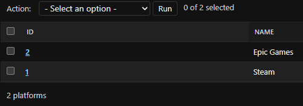
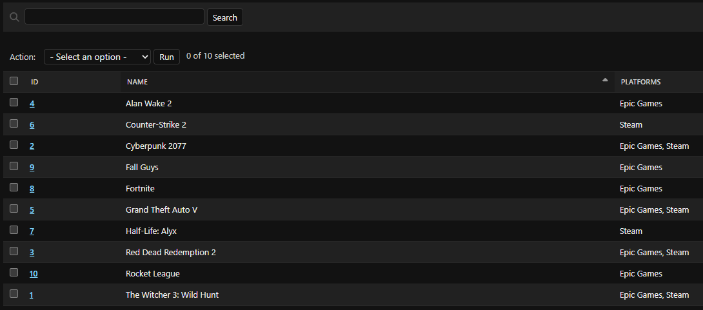
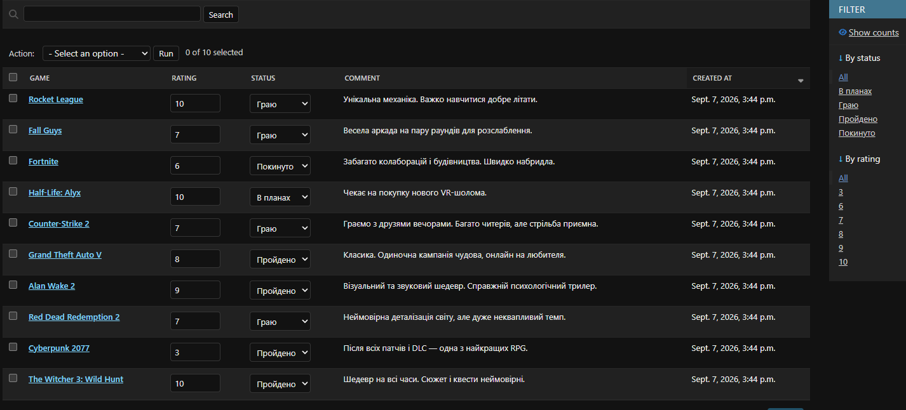

# Game Collection Tracker

A Django web application designed to manage and track a personal video game collection: record gaming platforms, completion statuses, ratings, and personal reviews.

## Features & Models
- **Platform**: Gaming platform or digital storefront (e.g., Steam, Epic Games, PlayStation Network).
- **Game**: Video game details (connected via a `ManyToManyField` to the `Platform` model).
- **Review**: Review and walkthrough progress card (linked via a `ForeignKey` to the `Game` model), containing a 1–10 rating, completion status (`choices`), review text, and creation timestamp (`DateTimeField`).
- **User Authentication**: Signup, login, and user-associated reviews.
- **Production Ready**: Configured with `django-environ`, `WhiteNoise` for static files, and `Gunicorn` WSGI server.

## Technologies
- **Backend**: Python, Django
- **WSGI / Production**: Gunicorn, WhiteNoise
- **Database**: SQLite (Local development) / PostgreSQL (Production)
- **Package Management**: uv / pip

---

## Live Demo
*(Deployment link will be added after the live deployment session)*

---

## Prerequisites & Package Manager

This project uses **uv**, a fast Python package manager. Check if it is installed on your machine:

```bash
uv --version
```

### Installing uv (If not installed)

If the command above is not recognized, install `uv` using one of the official methods for your operating system:

* **macOS / Linux:**
  ```bash
  curl -LsSf [https://astral.sh/uv/install.sh](https://astral.sh/uv/install.sh) | sh
  ```

* **Windows (PowerShell):**
  ```powershell
  powershell -ExecutionPolicy ByPass -c "irm [https://astral.sh/uv/install.ps1](https://astral.sh/uv/install.ps1) | iex"
  ```

---

## Quick Start (Local Setup)

1. **Clone the repository:**
   ```bash
   git clone <your-repository-url>
   cd Django_Game_Collection
   ```

2. **Install dependencies and create virtual environment:**
   *Using `uv`:*
   ```bash
   uv sync
   ```
   *Or using standard `pip`:*
   ```bash
   python -m venv .venv
   # Windows:
   .venv\Scripts\activate
   # macOS / Linux:
   source .venv/bin/activate
   
   pip install -r requirements.txt
   ```

3. **Activate the virtual environment:**
   * **Windows (PowerShell / Command Prompt):**
     ```powershell
     .venv\Scripts\activate
     ```
   * **macOS / Linux:**
     ```bash
     source .venv/bin/activate
     ```

4. **Configure environment variables:**
   Copy the template file to create your local `.env`:
   ```bash
   # Windows (PowerShell):
   Copy-Item .env.example .env

   # Linux / macOS:
   cp .env.example .env
   ```
   *(Ensure `SECRET_KEY`, `DEBUG=True`, and `ALLOWED_HOSTS` are properly set in your local `.env`)*

---

## Database Setup & Run

1. **Apply database migrations:**
   ```bash
   python manage.py migrate
   ```

2. **Create a superuser for Django Admin:**
   ```bash
   python manage.py createsuperuser
   ```

3. **Start the local development server:**
   ```bash
   python manage.py runserver
   ```
   Open [http://127.0.0.1:8000/](http://127.0.0.1:8000/) in your browser.  
   The administration panel is available at: [http://127.0.0.1:8000/admin/](http://127.0.0.1:8000/admin/)

4. **Run the demo script with ORM queries (optional):**
   ```bash
   python queries.py
   ```

---

## Screenshots

### Platforms


### Games


### Reviews
